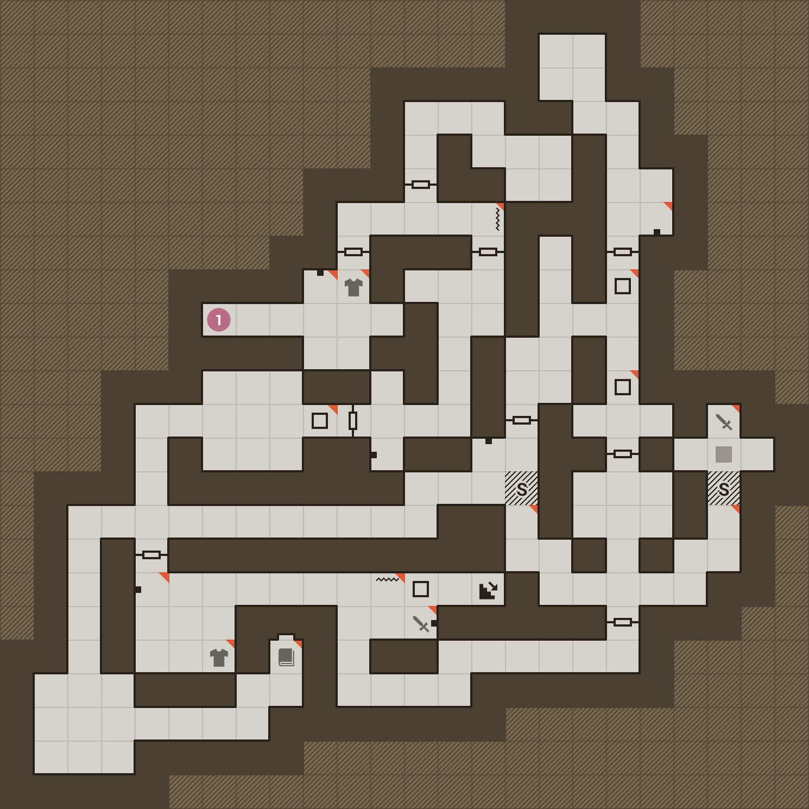
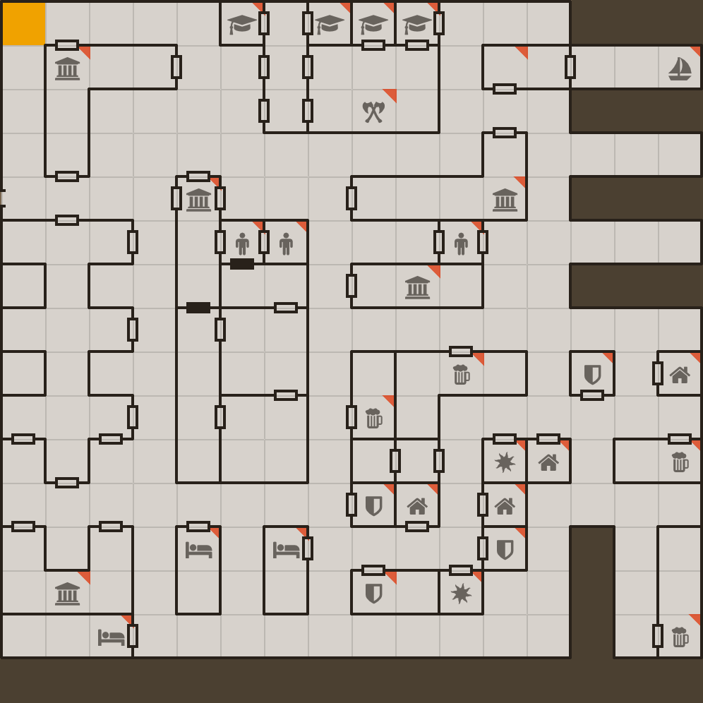
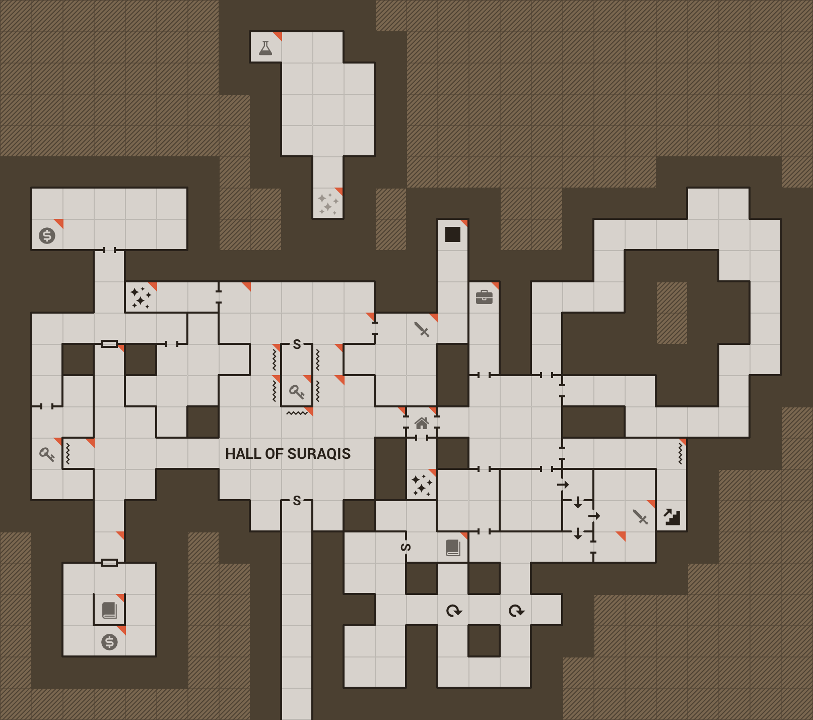

*************
Basic editing
*************

Most cRPG maps tend to fall into one of two categories: *tunnel style maps*, and
the more compact *wall style maps* (for lack of better terms). There's also a
less common third hybrid style that combines elements from both.

   Tunnel style -- Eye of the Beholder I

   Wall style -- Pool of Radiance

   Hybrid style -- The Dark Heart of Uukrul

Tunnel style maps are easiest to create with the *excavate* (*draw tunnel*)
tool. To use it, hold down the :kbd:`D` key and use the movement keys.
The name "excavate" is quite fitting, as all existing cell content is
deleted. Junctions are created on tunnel crossings, and neighbouring cells are
joined into larger areas.

The :kbd:`D` key acts as a *modifier key* when used together with the movement
keys (similarly to :kbd:`Shift` or :kbd:`Ctrl`). There are a few other tools
that work the same way:

* :kbd:`E` – erase whole cell, including walls (we'll talk about walls later)
* :kbd:`F` – draw/clear floor
* :kbd:`C` – set floor color

New cells are drawn with the current floor color. You can cycle through the
available floor colors with the :kbd:`,` and :kbd:`.` keys. To
"pick" the floor color from the current cell, press :kbd:`I`.

Gridmonger has a virtually unlimited undo history (only limited by your
computer's memory). You can undo most actions with :kbd:`Ctrl+Z` or :kbd:`U`,
and redo them with :kbd:`Ctrl+Y` or :kbd:`Ctrl+R`. The only actions that
cannot be undone is the creation of a new map (which discards the current
map), and some of the operations related to :ref:`basic-editing:Trail mode`.

Floor types
===========

But how do we create doors, pressure plates, pits, teleports, and all sorts of
other paraphernalia so common in well-designed dungeons?

Because these contraptions take up an entire cell, they are represented as
different *floor types*. You can draw them with the number keys :kbd:`1` to
:kbd:`6`. But there are 20 floor types in total, so how does that exactly
work?

Each number key is assigned to up to four floor types. You can cycle forward
between all floor types of a particular number key by pressing the key, and
backward by pressing :kbd:`Shift` and the key.

.. raw:: html

    <table class="floors">
      <thead>
        <tr>
          <th class="key">Key</th>
          <th class="icon">Floor</th>
          <th class="name">Name</th>
        </tr>
      </thead>

      <tbody>
        <tr>
          <td class="key" rowspan="3"><kbd>1</kbd></td>
          <td class="icon"></td>
          <td class="name">open door</td>
        </tr>
        <tr>
          <td class="icon"></td>
          <td class="name">locked door</td>
        </tr>
        <tr>
          <td class="icon"></td>
          <td class="name">archway</td>
        </tr>
      </tbody>

      <tbody>
        <tr>
          <td class="key" rowspan="4"><kbd>2</kbd></td>
          <td class="icon"></td>
          <td class="name">secret door</td>
        </tr>
        <tr>
          <td class="icon"></td>
          <td class="name">secret door (block style)</td>
        </tr>
        <tr>
          <td class="icon"></td>
          <td class="name">one-way door (N/E)</td>
        </tr>
        <tr>
          <td class="icon"></td>
          <td class="name">one-way door (S/W)</td>
        </tr>
      </tbody>

      <tbody>
        <tr>
          <td class="key" rowspan="2"><kbd>3</kbd></td>
          <td class="icon"></td>
          <td class="name">pressure plate</td>
        </tr>
        <tr>
          <td class="icon"></td>
          <td class="name">hidden pressure plate</td>
        </tr>
      </tbody>

      <tbody>
        <tr>
          <td class="key" rowspan="4"><kbd>4</kbd></td>
          <td class="icon"></td>
          <td class="name">closed pit</td>
        </tr>
        <tr>
          <td class="icon"></td>
          <td class="name">open pit</td>
        </tr>
        <tr>
          <td class="icon"></td>
          <td class="name">hidden pit</td>
        </tr>
        <tr>
          <td class="icon"></td>
          <td class="name">ceiling pit</td>
        </tr>
      </tbody>

      <tbody>
        <tr>
          <td class="key" rowspan="4"><kbd>5</kbd></td>
          <td class="icon"></td>
          <td class="name">teleport source</td>
        </tr>
        <tr>
          <td class="icon"></td>
          <td class="name">teleport destination</td>
        </tr>
        <tr>
          <td class="icon"></td>
          <td class="name">spinner</td>
        </tr>
        <tr>
          <td class="icon"></td>
          <td class="name">invisible barrier</td>
        </tr>
      </tbody>

      <tbody>
        <tr>
          <td class="key" rowspan="4"><kbd>6</kbd></td>
          <td class="icon"></td>
          <td class="name">stairs down</td>
        </tr>
        <tr>
          <td class="icon"></td>
          <td class="name">stairs up</td>
        </tr>
        <tr>
          <td class="icon"></td>
          <td class="name">entrance door</td>
        </tr>
        <tr>
          <td class="icon"></td>
          <td class="name">exit door</td>
        </tr>
      </tbody>

      <tbody>
        <tr>
          <td class="key"><kbd>7</kbd></td>
          <td class="icon"></td>
          <td class="name">bridge</td>
        </tr>
      </tbody>

    </table>

Most door types can be oriented either horizontally or vertically. When
placing them in tunnels (as you normally would), the program can figure out
the correct orientation. Should you need it, you can always change the
floor orientation manually with the :kbd:`O` key.

.. rst-class:: style1

Wall types
==========

Drawing walls works a bit differently. The program makes a distinction between
*regular walls* (the most common wall type you will draw) and so-called
*special walls*.

To draw regular walls, hold down the :kbd:`W` key and press one of the
movement keys. This toggles the current cell's wall in that direction
according to the following rules:

- if no wall exists, a regular wall is created
- if the existing wall is a regular wall, the wall is removed
- if the existing wall is a special wall, it is turned into a regular wall

Although this might sound a bit complex, it's really simple and intuitive in
practice. Just give it a go!

Special walls are used for drawing all the different door types you've seen
previously as wall types, plus to represent some gadgets such as levers,
statues, keyholes, etc.

To draw special walls similary to the method described above, hold down the
:kbd:`R` key and press one of the movement keys. This will use the current
special wall type, as indicated in the right-side tools pane. You can toggle
the visibility of the tools pane with :kbd:`Alt+T`.

To select the current special wall type, use the :kbd:`[` and
:kbd:`]` keys.

.. raw:: html

    <table class="walls">
      <thead>
        <tr>
          <th class="icon">Special wall</th>
          <th class="name">Name</th>
        </tr>
      </thead>

      <tbody>
        <tr>
          <td class="icon"></td>
          <td class="name">open door</td>
        </tr>
        <tr>
          <td class="icon"></td>
          <td class="name">locked door</td>
        </tr>
        <tr>
          <td class="icon"></td>
          <td class="name">archway</td>
        </tr>
        <tr>
          <td class="icon"></td>
          <td class="name">secret door</td>
        </tr>
        <tr>
          <td class="icon"></td>
          <td class="name">one-way door</td>
        </tr>
        <tr>
          <td class="icon"></td>
          <td class="name">illusory wall</td>
        </tr>
        <tr>
          <td class="icon"></td>
          <td class="name">invisible wall</td>
        </tr>
        <tr>
          <td class="icon"></td>
          <td class="name">lever</td>
        </tr>
        <tr>
          <td class="icon"></td>
          <td class="name">niche</td>
        </tr>
        <tr>
          <td class="icon"></td>
          <td class="name">statue</td>
        </tr>
        <tr>
          <td class="icon"></td>
          <td class="name">keyhole</td>
        </tr>
        <tr>
          <td class="icon"></td>
          <td class="name">writing</td>
        </tr>
      </tbody>

    </table>

.. rst-class:: style1

Trail Mode
==========

In *Trail Mode*, you'll leave a trail behind the cursor as you move it around.
You can then "draw in" the map over it (this is really only useful for
tunnel-style maps), or you can use it to track your movement over an already
mapped area.

You can toggle **Trail Mode** with the :kbd:`T` key; you'll see two footsteps
in the top left corner when it's on.

Similarly to the erase cell tool, you can erase the trail one cell at a time
by holding :kbd:`X` and using the movement keys. This action, just like
drawing the trail, cannot be undone.

To delete the whole trail in the current level, press :kbd:`Ctrl+Alt+X`.
Because this action is quite destructive, it can be undone.

To excavate the whole trail in the current level (overwriting existing cell
contents), press :kbd:`Ctrl+Alt+D`. Similarly to deleting the whole trail,
this action can be undone as well.

When you save your map, the trail data for all levels is stored in the map
file.

.. note::

    *Trail Mode* is turned off automatically when performing an action that
    would yield confusing or unwanted results with it being on (e.g. creating
    or deleting levels, changing the current level, entering *Select Mode*,
    etc.)

.. rst-class:: style3 big

Editing in WASD Mode
====================

In :ref:`moving-around:WASD Mode`, the editing shortcuts :kbd:`D`, :kbd:`W`
and :kbd:`E` are not available as they're used for movement. But this is not
a problem; you're supposed to use mouse modifiers instead of these shortcuts.

For example, hold down the left mouse button and use the
:kbd:`W`:kbd:`A`:kbd:`S`:kbd:`D` movement keys to draw tunnels.

The following mouse modifiers are available:

* Left button -- draw tunnel
* Right button -- draw wall
* Right & left buttons -- draw special wall
* Middle button -- erase cell

The mouse cursor must be inside the level area when using the mouse modifiers.

To draw special walls, make sure to press then right mouse button first,
*then* the left one (otherwise you'd end up in draw tunnel mode).

.. tip::

    To move the cursor using the mouse, you can press :kbd:`Tab` to go back to
    *Normal Mode*, left-click on a cell to move the cursor there, then press
    :kbd:`Tab` again to return to *WASD Mode*.

.. tip::

    Some games, such as the renowned
    `Eye of <https://en.wikipedia.org/wiki/Eye_of_the_Beholder_(video_game)>`_
    `the Beholder <https://en.wikipedia.org/wiki/Eye_of_the_Beholder_II:_The_Legend_of_Darkmoon>`_
    `series <https://en.wikipedia.org/wiki/Eye_of_the_Beholder_III:_Assault_on_Myth_Drannor>`_,
    don't support WASD-style navigation. Luckily, most emulators (e.g.
    `DosBox <https://www.dosbox.com/>`_ and `WinUAE <https://www.winuae.net/>`_)
    provide a way to remap the cursor keys to the WASD movement keys in these
    games.

